# SistemSPP_Sekolah_Flask

<justify> 
Sistem ini merupakan aplikasi berbasis web yang dibangun menggunakan Flask untuk membantu pengelolaan pembayaran SPP siswa di lingkungan sekolah.
</justify>

<h2>Pemasangan & Persiapan</h2>
<h4>1. Clone repositori</h4>

 git clone https://github.com/krisnasuma/SistemSPP_Sekolah_Flask.git

 cd SistemSPP_Sekolah_Flask

<h4>2. Aktifkan virtual environment (opsional)</h4>

python -m venv venv 

 source venv/bin/activate  # Linux/macOS 

 venv\\Scripts\\activate   # Windows 

<h4>3. Install dependensi </h4>

 pip install -r requirements.txt 

<h4>4. Jalankan aplikasi </h4>

 pip install -r requirements.txt 

<h4>5. Jalankan aplikasi </h4>

 pip install -r requirements.txt 

<h4>6. Akses melalui browser </h4>

 http://localhost:5000 

<h4>7. Masuk hanya melalui mode admin </h4>

 Usernane: admin 

 Password: admin123 

<h2> Hasil Konsep Tampilan </h2>

<h4>🖼️ Tampilan Login</h4> 

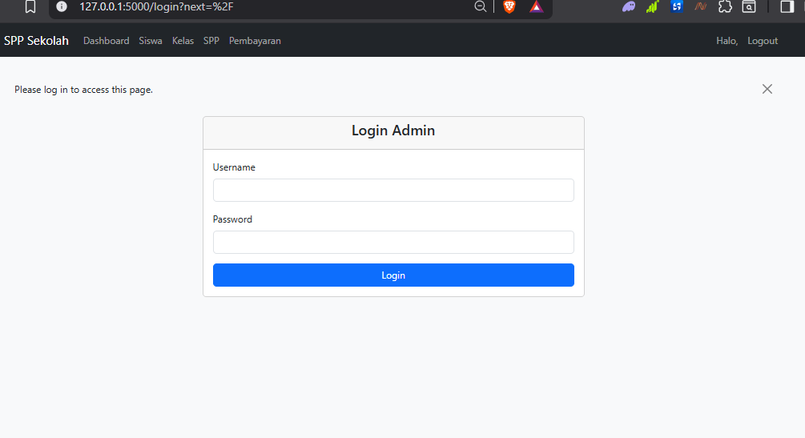

<h4>🖼️ Tampilan Kelas</h4> 

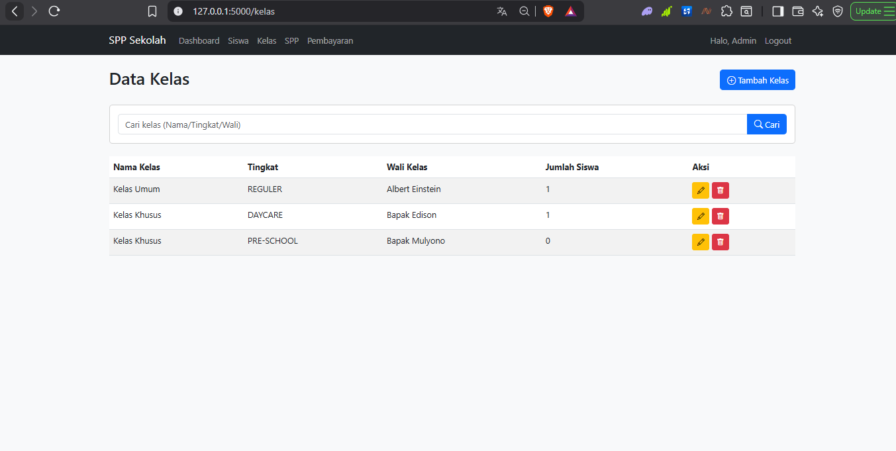  
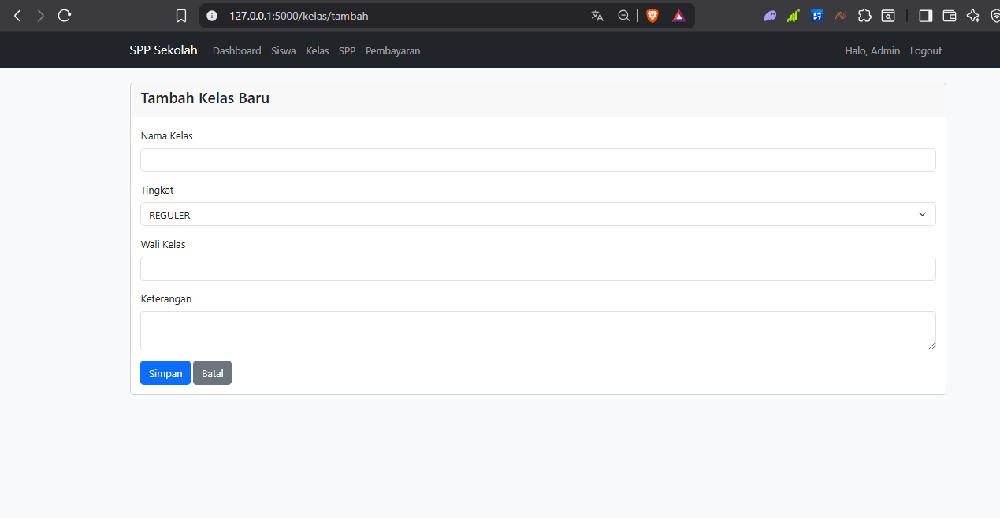  
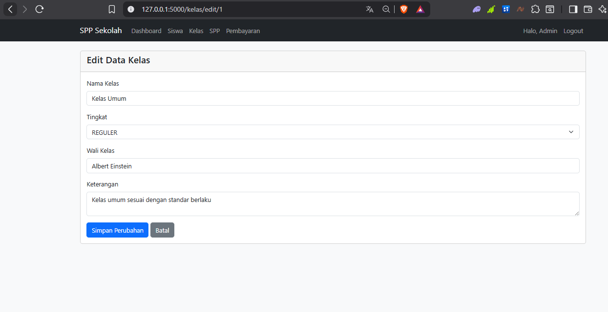

<h4>🖼️ Tampilan Siswa</h4> 

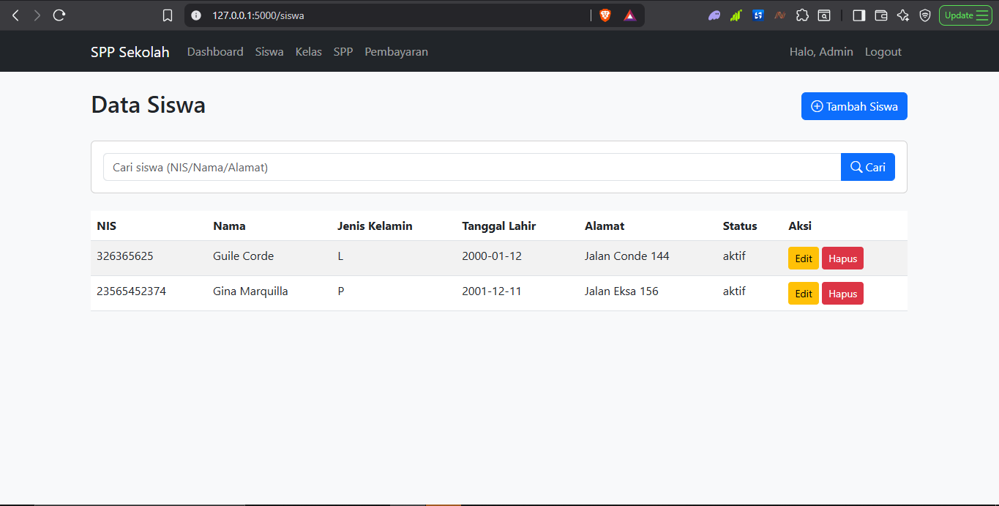  
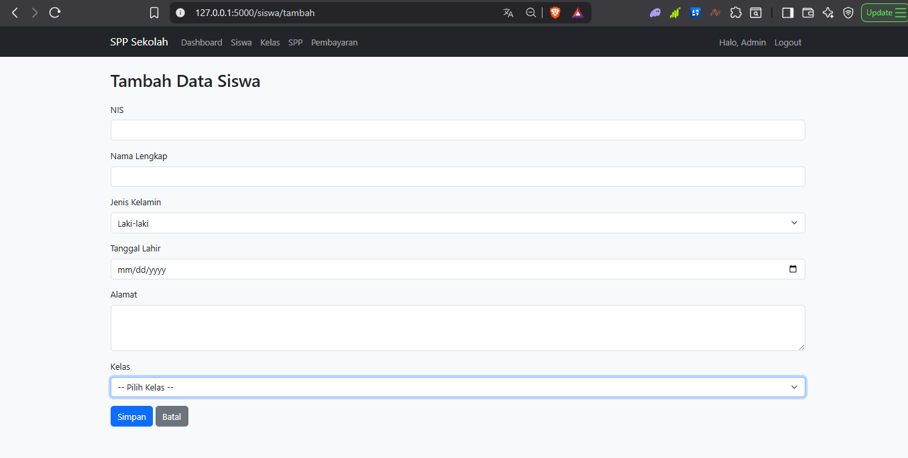  
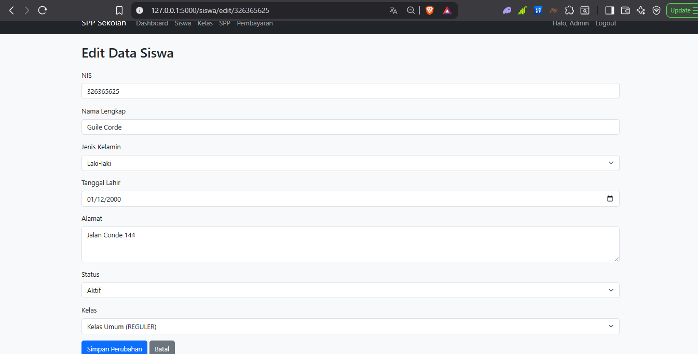

<h4>🖼️ Tampilan SPP</h4> 

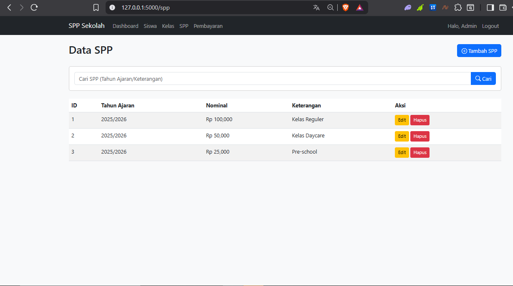  
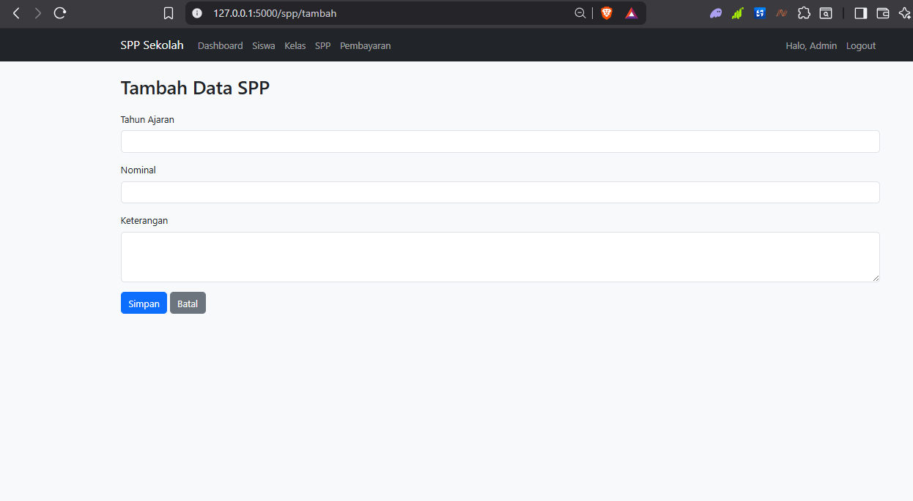  
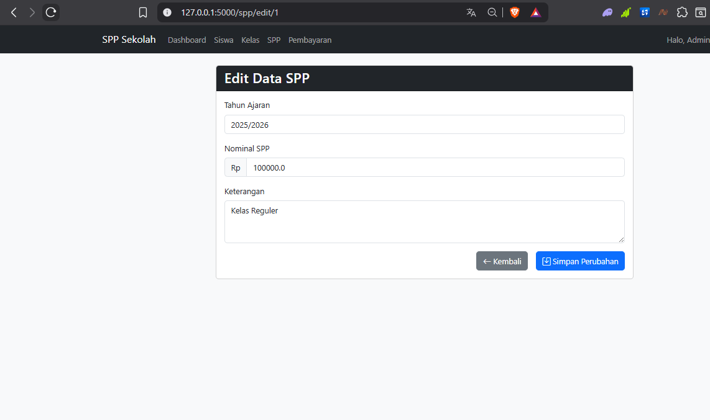

<h4>🖼️ Tampilan Pembayaran</h4> 

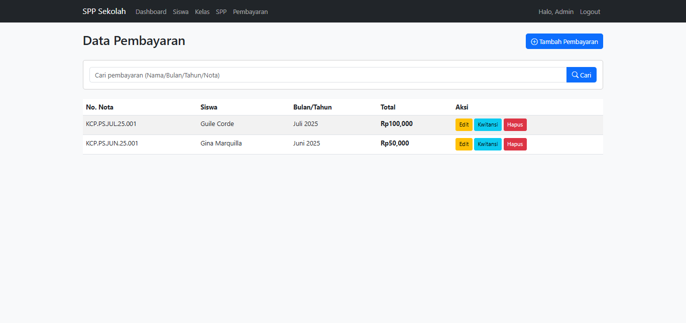  
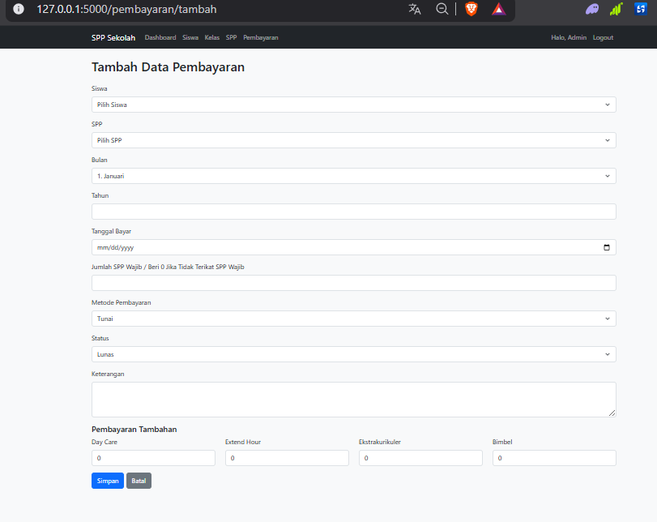  
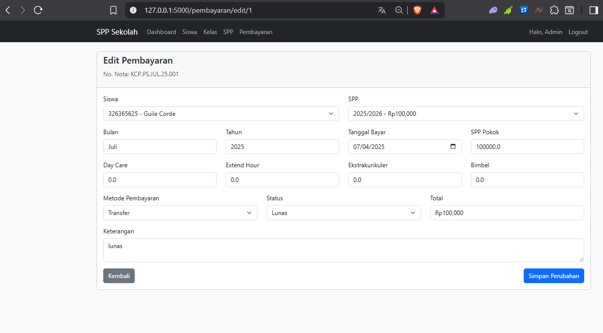  
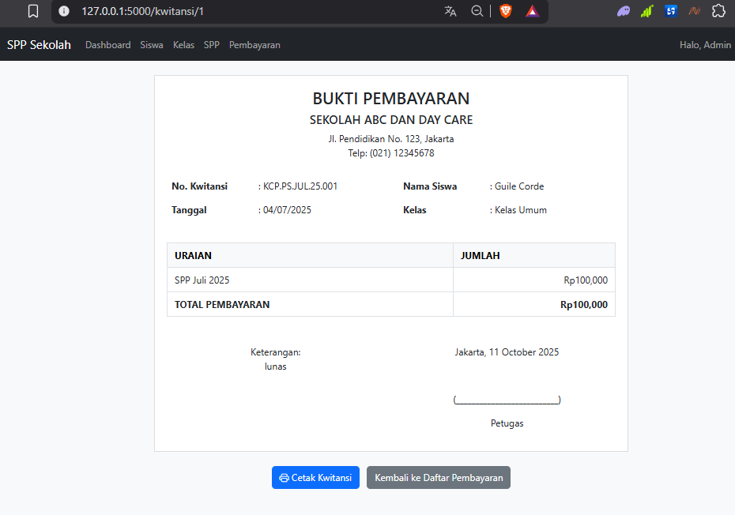

<h4>🖼️ Dashboard </h4> 

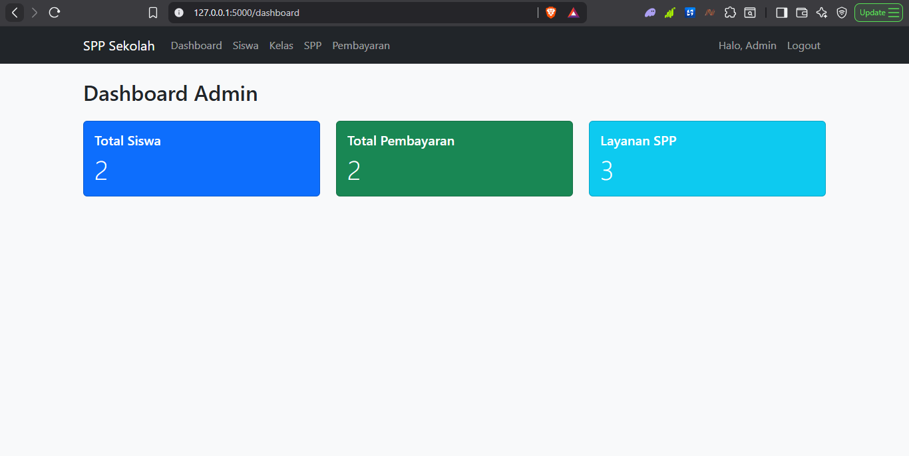  

<h2> Struktur Folder </h2>
├── __pycache__/  
├── instance/  
├── static/  
├── templates/  
├── app.py  
├── database.db  
├── requirements.txt  
├── README.md  

<h2> Alur Penggunaan </h2>
1. Isi dahulu halaman "Kelas".  
2. Isi halaman "SPP".  
2. Isi halaman "Siswa".  
3. Isi halaman "Pembayaran".

<h2> Fitur </h2>
1. Manajemen data siswa dan kelas.  
2. Input dan edit nominal SPP.  
3. Pencatatan transaksi pembayaran.  
4. Tampilan kwitansi pembayaran.  
5. Login khusus admin.  
6. Antarmuka berbasis HTML dan template Flask.

<h2> Tujuan Penggunaan </h2>

  Proyek ini bersifat open-source dan dapat digunakan untuk keperluan edukasi, pengembangan, atau modifikasi sesuai kebutuhan.

